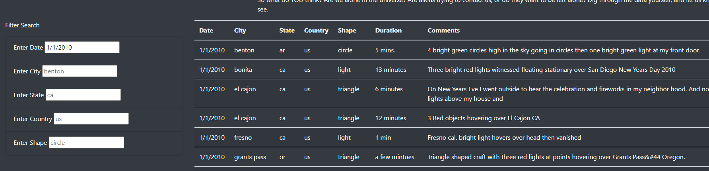

# UFOs

## Purpose
Javascript and HTML code were used to create a webpage with dynamic filtering functionality. Dana’s findings about UFO sightings were posted to the web using these two coding languages. Javascript was used to filter and display the data findings in a table. HTML code was used to display her article, data table, and search filters in a neat and organized fashion.

## Results
Users visiting the site can filter based on various criteria using the “filter search” section of the webpage. With the dynamic filtering function, users can filter by one search criteria or by multiple as seen in the images below. 

## Summary
