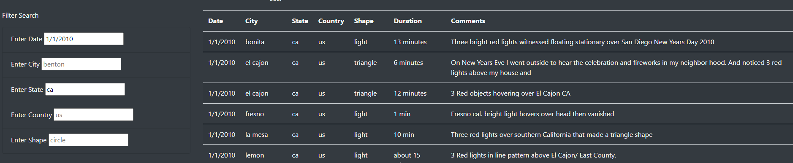

# UFOs

## Purpose
Javascript and HTML code were used to create a webpage with dynamic filtering functionality. Dana’s findings about UFO sightings were posted to the web using these two coding languages. Javascript was used to filter and display the data findings in a table. HTML and css code were used to display her article, data table, and search filters in a neat and organized fashion.

## Results
Users visiting the site can filter based on various criteria using the “filter search” section of the webpage. In this updated version of the website, there is no need for a filter button as the table will automatically filter once the user inputs the search criteria and presses the "enter" key on their keyboard. With the dynamic filtering function, users can also filter by one search criteria or by multiple  unlike the previous page which only had one filter option. Below you can see an example of the single filter and multiple filter search results.

## Summary

A drawback with this webpage design is the lack of compatibility between devices. The table does not adjust/reformat if the website is viewed on mobile, leaving information cut off. This also doubles as a recommendation to fix device compatibility so that data can be viewed comfortably for users on different devices.

Another recommendation could be to reformat the page completely and place the table and filters onto a second page to make the webpage look neater and also add in a survey. Tab options could be placed under the article description so users can click on the link to the search table.

